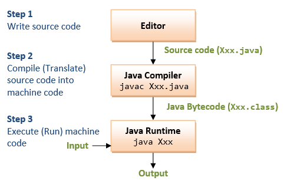
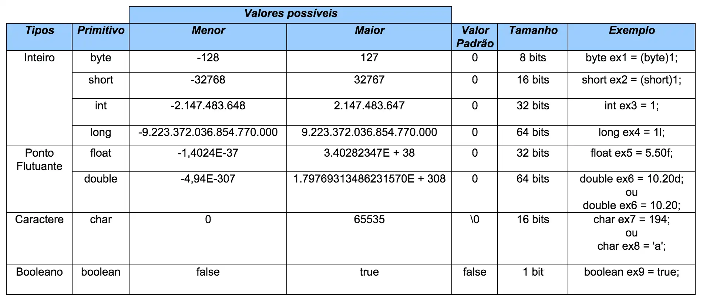

## *Oi, eu sou o Miguel!*
Sou um estudante que esta buscando aprender Java.  
Aqui ficarão minhas anotações do curso de Java do **DevDojo** 

## Como o Java funciona?

O Java funciona com um compilador, que vai transformar o arquivo .java 
em um arquivo .class (bytecode), para ser lido por um JVM (Java Virtual Machine),
que difere para cada sistema operacional.

## Tipos Primitivos

Os Tipos Primitivos vão guardar em memória um valor simples  
Java possui **8 tipos primitivos**, sendo eles: 
int -> Funciona para **número inteiros pequenos** 
long -> Funciona para **número inteiros grandes**  
float -> Funciona para **números decimais pequenos**  
double -> Funciona para **números decimais grandes**  
byte -> valores capazes de serem armazenados em **1 byte** (8 bits)  
short -> valores capazes de serem armazenados em **2 bytes** (16 bits)  
boolean -> Valores **verdadeiros** ou **falsos**  
char -> Capaz de armazenar **1 caractere** ou valores da **tabela ASCII** ou **tabela Unicode**  

*Tabela com cada tipo primitivo e seu tamanho*

Note que com excessão do tipo *boolean*, todos os valores armazenam **valores númericos**.

Cast -> Força o Java a colocar uma variavel de um tipo primitivo em outra de outro tipo primitivo  
*Não é uma boa prática, já que é só trocar o tipo primitivo da váriavel*  

### Troquei o Project language level do 21 para o 8.

## Operadores

### Aritméticos  
**Sinais**   + = soma   - = subtração  * = multiplicação / = divisão 

*Se você dividir dois números inteiros, o resultado sempre será um inteiro.*

### Relacionais  
Sempre vão retornar valores lógicos (*true* ou *false*)

**Sinais**  > : Maior que   < : Menor que   >= : Maior ou igual a   <= : Menor ou igual a   == : igual a   != : Diferente de  

### Lógicos  
Serve para comparar valores lógicos (*true* ou *false*)

**Sinais**   && = and -> todas as afirmações tem que ser verdadeiras, para o operador ser verdadeiro.  || = or -> apenas uma afirmação precisa ser verdadeira, para o operador ser verdadeiro.  

### Operadores de Atribuição
Servem para escrever um código mais curto

**Sinais**   
= : atribui um valor a uma variavel  
+= : adiciona um valor a variável   
-= : subtrai um valor da variavel   
*= : multiplica a variavel por um valor   
/= divide a variavel por um valor   
%= : calcula o resto da divisão por um valor  

*++ -- -> forma mais abreviada ainda dos operadores de atribuição*  
se colocar o ++/-- antes da variavel, o compilador irá adicionar +1 ou subtrair -1 antes de utilizar a variavel.  
se colocar o ++/-- depois da variavel, o compilador irá usar a variável primeiro, depois ira adicionar/subtrair 1.

